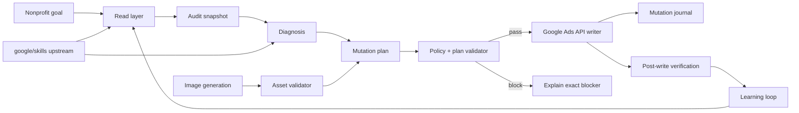

<div align="center">

# Google Ad Grants Autopilot

**An autonomous, policy-aware control plane for nonprofit Google Ads — built to turn an Ad Grant into measurable mission impact, not vanity spend.**

[](https://github.com/EthicalSaving-gUG/google-ad-grants-autopilot/actions/workflows/validate.yml)
[](LICENSE)
[](https://developers.google.com/google-ads/api)
[](https://www.google.com/grants/)
[](SKILL.md)

**Audit → diagnose → plan → validate → mutate → verify → learn → repeat.**

</div>

---

## Why this exists

Google Ad Grants gives eligible nonprofits up to **USD 10,000/month of in-kind advertising**, but unused budget is not a goal by itself. The hard problem is deploying the grant responsibly while keeping search intent, landing pages, conversion tracking, bidding, creative quality and program policy aligned.

This project packages that operating model as a reusable **ChatGPT Skill** plus deterministic Python guardrails and a write-capable Google Ads API runner.

The objective is simple:

> **Use as much of the available grant as relevant demand and policy allow — while optimizing for meaningful nonprofit outcomes.**

That means donations, qualified contacts, applications, research engagement or other real mission actions. It explicitly does **not** mean manufacturing page-view conversions or broad irrelevant traffic just to make the spend chart look full.

---

## What the Autopilot does

### Diagnose

- inspect campaigns, ad groups, ads, keywords and search terms
- compare 7-day / 30-day / prior-period performance
- distinguish **rank loss** from **budget loss**
- detect zero-impression campaigns and weak Ad Strength
- inspect conversion actions before trusting Smart Bidding
- flag non-HTTPS or mismatched landing pages
- treat Search and Performance Max as different structures

### Optimize

- create/pause Search campaigns and ad groups
- create/pause keywords and negative keywords
- create Responsive Search Ads
- update campaign budgets
- add geo/language targeting
- create and attach sitelinks and callouts
- create and attach Search image assets
- create conversion actions
- switch individual conversion actions between **Primary** and **Secondary** with `primary_for_goal`

### Protect

- fail closed unless the target is explicitly verified as an Ad Grants account
- require an account allowlist for live writes
- require `GOOGLE_ADS_AUTONOMY=1` before mutations
- require a human-readable `reason` for every operation
- reject non-HTTPS RSA/sitelink destinations
- optionally restrict writes to approved landing-page domains
- block conversion-based bidding creation until conversion health is verified
- block routine destructive deletes; pause instead
- journal every live mutation attempt and result
- never store Ads/OAuth secrets in Git

### Create assets

The Skill can call an available image-generation capability to create campaign-specific visual assets, then validate and upload them through the Ads API path.

For Search image assets, the current validator supports:

- square **1:1** — recommended 1200×1200, minimum 300×300
- landscape **1.91:1** — recommended 1200×628, minimum 600×314
- PNG/JPG
- max 5120 KB

Google's current image policy disallows text/graphic overlays including logos in these image assets. The deterministic validator checks file properties; visual/policy review remains a separate step.

---

## Architecture



The official Google `google/skills` Ads material is treated as an **upstream setup and diagnostics reference**. Google's MCP path can be used for reading where available; mutations go through a write-capable connector or the regular Google Ads API.

---

## Safety model

Autonomy is powerful only when the blast radius is explicit.

A live API mutation requires all of the following:

```bash
export GOOGLE_ADS_AUTONOMY=1
export GOOGLE_ADS_ALLOWED_CUSTOMER_IDS="YOUR_10_DIGIT_CUSTOMER_ID"
export GOOGLE_ADS_CUSTOMER_ID="YOUR_10_DIGIT_CUSTOMER_ID"

export GOOGLE_ADS_DEVELOPER_TOKEN="..."
export GOOGLE_ADS_CLIENT_ID="..."
export GOOGLE_ADS_CLIENT_SECRET="..."
export GOOGLE_ADS_REFRESH_TOKEN="..."
# optional for MCC hierarchies
export GOOGLE_ADS_LOGIN_CUSTOMER_ID="..."
```

**Never commit these values.** Use environment injection, GitHub Actions secrets, a password manager or a production secret manager.

The mutation plan must independently assert:

```json
{
  "account_kind": "AD_GRANTS",
  "verified_ad_grants": true
}
```

These controls are intentionally redundant: a mistaken plan should not be enough to mutate the wrong account, and a mistaken environment should not be enough to bypass plan validation.

---

## Quick start

### 1. Clone

```bash
git clone https://github.com/EthicalSaving-gUG/google-ad-grants-autopilot.git
cd google-ad-grants-autopilot
```

### 2. Run the offline checks

```bash
python -m py_compile scripts/*.py
python scripts/audit_snapshot.py references/audit.example.json
python scripts/ad_grants_plan.py references/plan.example.json
python scripts/google_ads_apply.py --plan references/plan.example.json
```

The write runner is a **dry run by default**. No Ads mutation occurs without `--apply` **and** the runtime safety environment.

### 3. Audit a live account through your read connector

Normalize the reporting output to the shape in [`references/audit.example.json`](references/audit.example.json):

```bash
python scripts/audit_snapshot.py my-snapshot.json --json
```

A deliberately broken example is included to test the guards:

```bash
python scripts/audit_snapshot.py references/audit.problem.example.json --fail-on CRITICAL
```

### 4. Create a mutation plan

Start from [`references/plan.example.json`](references/plan.example.json) and the schema guide in [`references/plan-schema.md`](references/plan-schema.md).

Every operation needs a reason:

```json
{
  "type": "negative_keyword_create",
  "ad_group_id": "1234567890",
  "text": "jobs",
  "match_type": "EXACT",
  "reason": "Exclude employment intent from a donation ad group."
}
```

Validate it:

```bash
python scripts/ad_grants_plan.py plan.json
```

### 5. Apply only after the read-side evidence is clean

```bash
python scripts/google_ads_apply.py --plan plan.json --apply
```

The default change journal is written to:

```text
runtime/mutation-journal.jsonl
```

`runtime/` is gitignored.

---

## The optimization loop

The Skill follows a fixed operating sequence:

1. **Identify the exact account.** Never infer from a remembered customer ID.
2. **Verify Ad Grants context.** Do not use the autonomous writer on a normal billed account.
3. **Query live state.** Campaigns, structure, ads, keywords, search terms, goals, assets, policy status and change history.
4. **Audit conversion hygiene first.** Smart Bidding is only as good as the goal signal.
5. **Diagnose the limiting factor.** Search volume, rank, budget, geo, policy, landing page, creative or bidding.
6. **Build a narrow mutation plan.** Prefer reversible changes.
7. **Validate locally.** Deterministic guards run before the Google API.
8. **Apply autonomously.** No per-keyword confirmation loop for an approved target account.
9. **Verify live state again.** Never equate an API request with a successful serving outcome.
10. **Learn from the next observation window.** Optimize mission outcomes, not raw spend.

---

## First real-world iteration: Ethical Saving

The Skill was not designed only on paper. Its first live read-side iteration used the connected Ethical Saving Google Ads account on **2026-08-14**.

That audit exposed exactly the kinds of failure modes this project now guards against:

- multiple enabled campaigns with no recent delivery
- Search campaigns losing most available impression share to **Ad Rank rather than budget**
- several Responsive Search Ads with **Poor** Ad Strength
- generic homepage destinations where dedicated intent-matched landing pages exist
- at least one live ad destination still using `http://`
- legacy/unrelated conversion actions mixed into the account's goal set
- Search structures that need explicit Ad Grants compliance checking
- a Performance Max campaign, which current Google Ad Grants setup guidance now supports and therefore must be handled separately from Search structure rules

The result of that first iteration was not “raise every budget.” It was to make the Autopilot more skeptical:

- conversion hygiene now gates conversion-based bidding plans
- HTTPS is mandatory in generated RSA/sitelink plans
- optional domain allowlisting prevents accidental cross-domain traffic
- every write requires a reason and receives a mutation journal entry
- the audit engine distinguishes rank problems from budget problems
- Search-only structure checks no longer get incorrectly applied to Performance Max

That is the intended development philosophy: **use the system, observe where it can fail, then encode the lesson as a guardrail.**

---

## Google Ad Grants policy posture

This repository does not freeze program rules forever. The Skill is instructed to re-check current official Google sources before material changes.

Captured in the current guard set:

- mission-based targeting and keywords
- single-word keyword restrictions and official exceptions
- two ad groups per Search campaign under the current compliance guide
- at least two unique sitelink assets
- account-level CTR compliance where applicable
- meaningful conversion tracking
- relevant geographic targeting
- high-quality owned/controlled landing pages
- standard Google Ads policies in addition to Ad Grants policy
- Performance Max support in the current Ad Grants campaign-creation guide

See [`references/ad-grants-policy.md`](references/ad-grants-policy.md) for the source register.

---

## Search vs. Performance Max

Google's current Ad Grants setup guide allows **Search or Performance Max** campaigns.

The project therefore treats them differently:

| Capability | Search | Performance Max |
|---|---:|---:|
| Read-side diagnostics | ✅ | ✅ |
| Conversion hygiene guard | ✅ | ✅ |
| Budget/rank diagnosis | ✅ | n/a / PMax-specific metrics |
| 2-ad-group compliance check | ✅ | Not applied |
| RSA creation | ✅ | n/a |
| Search image asset upload | ✅ | n/a |
| Deterministic API mutation runner | ✅ | 🚧 expanding |
| Native write connector path | ✅ if exposed | ✅ if exposed |

The deterministic runner deliberately does not pretend to support a resource it cannot safely construct. PMax mutation support is an explicit next expansion rather than an untested generic `mutate` call.

---

## Image assets and AI generation

Generated assets are allowed only when they are:

- original or otherwise rights-cleared
- relevant to the nonprofit mission and specific ad-group intent
- free of misleading medical imagery
- free of text/logo/button/badge overlays for Search image assets
- visually reviewed after generation
- validated before upload

Example:

```bash
python scripts/validate_assets.py \
  assets/research-square.jpg \
  assets/research-landscape.jpg
```

The project intentionally does **not** use OCR as a routine policy check. File validation is deterministic; visual policy review belongs in the agent/image workflow.

---

## Supported mutation operations

The current plan vocabulary includes:

```text
campaign_create
campaign_status
campaign_budget_set
ad_group_create
ad_group_status
keyword_create
negative_keyword_create
keyword_status
rsa_create
sitelink_create_attach
callout_create_attach
image_asset_create_attach
location_target_add
language_target_add
conversion_action_create
conversion_action_primary_set
```

Permanent delete operations are intentionally not part of the normal autonomous vocabulary.

---

## Repository layout

```text
.
├── SKILL.md                       # ChatGPT Skill control plane
├── agents/openai.yaml             # Skill UI metadata
├── scripts/
│   ├── audit_snapshot.py          # connector-agnostic account preflight
│   ├── ad_grants_plan.py          # deterministic mutation-plan validator
│   ├── google_ads_apply.py        # Google Ads API mutation runner
│   └── validate_assets.py         # Search image file validator
├── references/
│   ├── ad-grants-policy.md        # policy/source register
│   ├── api-reference.md           # credentials + API mutation notes
│   ├── audit.example.json         # clean normalized audit fixture
│   ├── audit.problem.example.json # deliberately broken fixture
│   ├── ethicalsaving-profile.md   # public reference implementation
│   ├── google-upstream.md         # google/skills integration notes
│   ├── plan-schema.md             # mutation plan contract
│   └── plan.example.json          # safe example plan
├── THIRD_PARTY_NOTICES.md
├── LICENSE
└── .github/workflows/validate.yml
```

---

## CI and testing

The GitHub Actions workflow compiles the scripts, validates a clean audit fixture, confirms that the broken audit fixture is caught, validates the example mutation plan and dry-runs the writer.

Locally:

```bash
python -m py_compile scripts/*.py
python scripts/audit_snapshot.py references/audit.example.json
! python scripts/audit_snapshot.py references/audit.problem.example.json --fail-on CRITICAL
python scripts/ad_grants_plan.py references/plan.example.json
python scripts/google_ads_apply.py --plan references/plan.example.json
```

The most important test is still post-mutation verification against the actual Google Ads account.

---

## Secrets and public-repo hygiene

This is a **public repository**. Do not open issues, commits or screenshots containing:

- Developer Tokens
- OAuth client secrets
- refresh/access tokens
- private credential JSON
- password-manager exports
- unredacted secret-bearing logs

Google Ads customer IDs are not used as defaults in the public reference profile. Supply the target through runtime configuration.

---

## Upstream and attribution

This project is intentionally complementary to Google's official agent tooling:

- [`google/skills`](https://github.com/google/skills) — official skills for Ads API setup and diagnostics
- [Google Ads API](https://developers.google.com/google-ads/api)
- [Google Ad Grants](https://www.google.com/grants/)

No Google skill source is vendored here. See [`THIRD_PARTY_NOTICES.md`](THIRD_PARTY_NOTICES.md).

Google, Google Ads and Google Ad Grants are trademarks of Google LLC. This project is maintained by Ethical Saving gUG and is not an official Google project.

---

## Roadmap

- [x] public ChatGPT Skill
- [x] deterministic mutation plan validator
- [x] Google Ads API Search write path
- [x] conversion-primary/secondary control
- [x] Search image asset validation/upload path
- [x] live-account audit model
- [x] mutation journal
- [ ] full deterministic Performance Max asset-group writer
- [ ] idempotent reconciliation/deduplication before every create
- [ ] automated post-write resource verification
- [ ] conversion-goal hierarchy management beyond `primary_for_goal`
- [ ] policy-status regression tests against normalized live snapshots
- [ ] richer asset-generation recipes by nonprofit intent

---

## Contributing

Issues and pull requests are welcome, especially for:

- current Ad Grants policy changes
- Google Ads API version changes
- PMax automation
- safer reconciliation/idempotency patterns
- nonprofit conversion-quality heuristics
- reproducible test fixtures that contain **no secrets or personal data**

When proposing a new mutation type, include:

1. the Google Ads API resource/service involved,
2. the failure mode it solves,
3. a deterministic preflight rule,
4. a rollback/pause strategy,
5. a test fixture.

---

## License

Apache License 2.0. See [`LICENSE`](LICENSE).

**Build automation that earns trust by being inspectable.**
